# Patient Payments — Flowchart

End-to-end flow for the patient payment UI and supporting APIs. Decision points where behavior is TBD are marked and will be filled in as you specify.

---

## Main flow (Mermaid)

```mermaid
flowchart TD
    Start([Patient has bill with account # and QR/URL]) --> Land[Land on practice URL<br/>unique hash]
    Land --> ValidHash{Practice hash<br/>valid?}
    ValidHash -->|No| Page404[Show 404 page]
    ValidHash -->|Yes| LoginPage[Landing: practice details, phone number<br/>Login: account number + last name]

    LoginPage --> LoginSubmit[Submit credentials]
    LoginSubmit --> LoginOK{Login succeeds?}

    LoginOK -->|No| FourFails{4 failed attempts<br/>in a row?}
    FourFails -->|Yes| CallPractice[Display: Call the practice directly to continue payment]
    FourFails -->|No| ErrType{API response?}
    ErrType -->|400| Msg400[Display: Credentials under this account and last name could not be found, please try again]
    ErrType -->|500| Msg500[Display: Something went wrong<br/>API logs error]
    Msg400 --> LoginPage
    Msg500 --> LoginPage

    LoginOK -->|Yes| JWT[JWT issued, HttpOnly]
    JWT --> GetCharges[Payments API → EMR: Get HoH charges]
    GetCharges --> ChargesOK{Charges received?}
    ChargesOK -->|Yes| BillPage[Redirect to payment page: itemized charges by patient, by date<br/>procedure names, full or partial amount]
    ChargesOK -->|No| RetryCharges[Retry Get HoH charges once]
    RetryCharges --> RetryOK{Charges received?}
    RetryOK -->|Yes| BillPage
    RetryOK -->|No| ChargesErr[Stay on login page. Display: There was an issue pulling your charges, please try again or contact your dental provider directly to continue making your payment.<br/>Log error. Track metric.]
    ChargesErr --> LoginPage

    BillPage --> EnterPayment[User enters payment amount + payment info]
    EnterPayment --> Provider[Payment provider processes payment]

    Provider --> PaymentStatus{Provider response?}
    PaymentStatus -->|Fully completed or<br/>Partially completed| Skeleton[Show skeleton loading. Still on make-payment page, no transaction ID in URL.]
    PaymentStatus -->|Any other<br/>payment failed| PayFail[Stay on payment page. Display provider error message at top.<br/>Show exactly what provider returned. Do not allow receipt.]
    PayFail --> EnterPayment

    Skeleton --> Wait[Wait for webhook or 2 min timeout]
    Wait --> TimeoutCheck{Webhook received<br/>within 2 min?}
    TimeoutCheck -->|No| TimeoutErr["Display: Something went wrong with provider. The transaction could not be completed. Please come back later to complete your payment. Replace 'provider' with provider name."]
    TimeoutCheck -->|Yes| Hook[Webhook received. Gateway → SQS → Payments API]
    Hook --> PostTx[Payments API → EMR: POST transactions]
    PostTx --> SaveOK{Save to DB<br/>succeeded?}
    SaveOK -->|Yes| Cache[Cache receipt data in Redis ~30min]
    SaveOK -->|No| DLQ[Push to DLQ. Alert support to investigate.<br/>Receipt data still in Redis ~30min for email/PDF.]
    Cache --> ReceiptPage[Load full receipt page: header, body, download PDF / email / print]
    DLQ --> ReceiptPage

    ReceiptPage --> ReceiptActions[User can: view, download PDF, email, print]
    ReceiptActions --> End([Done])
```

---

## Decision points (to be specified)

These are the yes/no splits where we need your decision. Answer **one at a time** and the flowchart will be updated.

### 1. Login fails — *specified*

- **400:** Display *"Credentials under this account and last name could not be found, please try again."* User can try again.
- **500:** Display *"Something went wrong."* API logs the error. User can try again.
- **4 failed attempts in a row:** Display message to call the practice directly to continue payment (landing page already shows practice details and phone number).
- **Rate limiting:** Handled by AWS API Gateway (not shown in flow).

---

### 2. Landing page / practice hash invalid — *specified*

- Invalid or unknown practice hash/URL → show **404 page**. No other instructions.

---

### 3. Get HoH charges fails (after login) — *specified*

- SPA: redirect to payment page only after itemized charges are successfully received. If Get charges fails, stay on login page.
- **Retry:** One automatic retry. If both attempts fail: stay on login page, display *"There was an issue pulling your charges, please try again or contact your dental provider directly to continue making your payment."* Log the error; track via metrics (see high-level §4). User can try again (e.g. re-submit login).

---

### 4. Payment provider response — *specified*

- **Success:** "Fully completed payment" and "Partially completed payment" are both successful → update charges in DB (POST transactions) → if that succeeds → load receipt page.
- **Failure:** Any other response (payment failed) → stay on current payment page, display the **exact error message from the payment provider** at the top of the page; do not allow moving to the receipt page. User can correct and retry.

---

### 5. After "Make payment" — skeleton, timeout, webhook/DB failure — *specified*

- **Immediately after click:** User sees a **skeleton loading** component (still on make-payment page, no transaction ID in URL); appears as if receipt is loading.
- **Timeout (2 min):** If webhook is not received within 2 minutes → display: *"Something went wrong with (insert provider name). The transaction could not be completed. Please come back later to complete your payment."*
- **Webhook received but API/DB save fails:** Still show the **full receipt page** (itemized details from make-payment page + payment details from webhook). Receipt data is still stored in Redis (~30 min) so they can generate email or PDF. Failed update pushes the item to **DLQ** → support team alerted to investigate.

---

### 6. Download receipt PDF fails — *specified*

- Show **red error with icon** below the download button. Message: *"Download failed. Please try again or email the receipt."* Log the error.

---

### 7. Receipt page timing and Print fallback — *specified*

- **Redis:** Receipt data cached ~30 min TTL (for email and PDF generation). Even when API failed to persist to DB (DLQ case), data is in Redis for 30 min so user can still email or download PDF.
- **JWT:** Expires after 10 min of idleness → user is redirected out.
- **Active >30 min on receipt page:** After 30 min, Redis data expires → user cannot generate receipt or download PDF via API. **Print** is the fallback: a 3rd option that prints a pdf-like version of the current webpage (browser print). User can save as PDF from the print dialog. No API or Redis required.

---

### 8. Email receipt fails — *specified*

- Same as download PDF failure: **red error with icon** below the email button. Message: *"Email failed. Please try again or download/print the receipt."* Log the error.

---

*All decision points for the main flow have been specified.*
